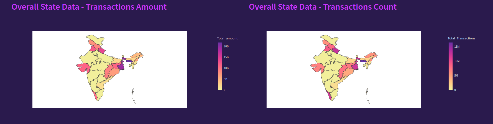
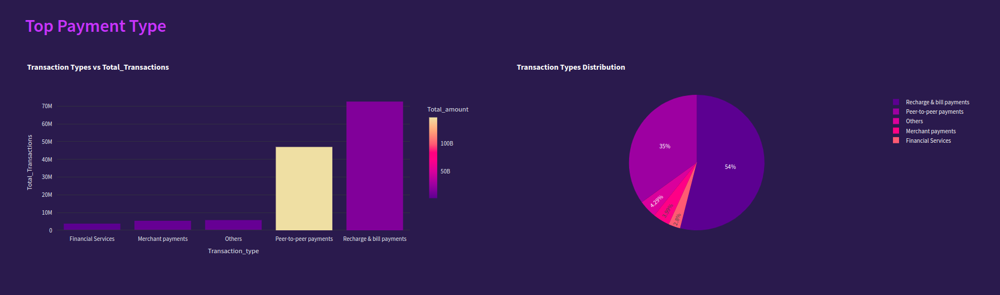
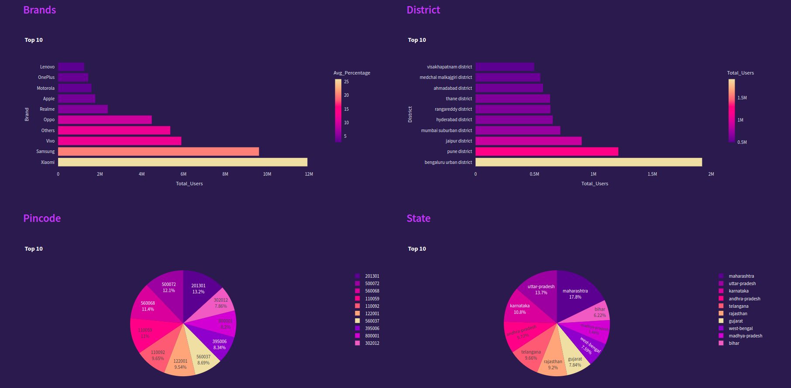
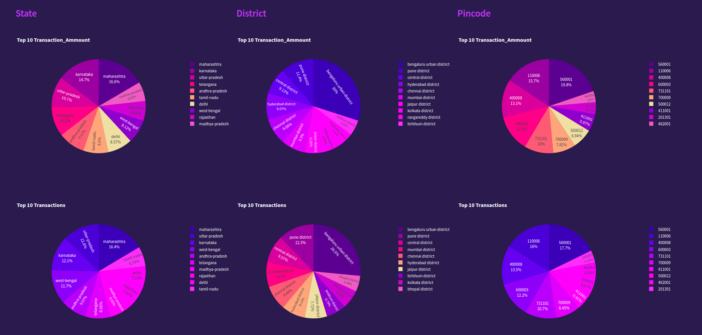

# Phonepe_Pulse_Data_Visualization_and_Exploration

The Phonepe Pusle Data Visualization and Exploration is a Python-based project that extracts data from the Phonepe Pulse Github repository, transforms and stores it in a MySQL database or a csv file, and displays it through an interactive dashboard using Streamlit, Plotly and few other visualization and data manipulation libraries. The solution includes with various visualizations, allowing users to select different facts and figures to display. The project is efficient, secure, and user-friendly, providing valuable insights and information about the data in the Phonepe Pulse Github repository from the year 2018 -2023.

## Table of Contents
- [LIBRARIES USED](#libraries-used)
- [Installation](#installation)
- [USAGE](#usage)
- [FEATURES](#features)
- [CONTRIBUTING](#contributing)
- [LICENSE](#license)
- [CONTACT](#contact)

## LIBRARIES USED
this project requires the following components:

1. [STREAMLIT](#streamlit)
2. [PYDECK](#pydeck)
3. [MySQL](#mysql)
4. [PANDAS](#pandas)
5. [PLOTLY](#plotly)

### STREAMLIT:

Streamlit library was used to create a user-friendly UI that enables users to interact with the programme and carry out data retrieval and analysis operations.

### PYDECK:

Pydeck is a Python library tailored for interactive 3D mapping and geospatial visualization. Leveraging Deck.gl, it simplifies complex data visualization tasks with an intuitive interface. Pydeck is ideal for creating interactive maps with various layers and features, making it a powerful tool for geospatial analysis and exploration

### MySQL:

MySQL is an open-source relational database management system (RDBMS) that is widely used for managing and organizing data. It is known for its reliability, scalability, and ease of use. MySQL uses a client-server model and is compatible with various programming languages, making it a popular choice for web applications.

### PANDAS:

Matplotlib is a 2D plotting library for creating static, animated, and interactive visualizations in Python. It provides a wide variety of plotting options and customization features, making it a powerful tool for data visualization. Matplotlib is often used for creating charts, graphs, histograms, and other types of plots.

### PLOTLY:

Plotly is a versatile Python library renowned for crafting interactive, publication-quality visualizations. Offering a wide array of charts, graphs, and dashboards, Plotly enables seamless customization and integration within Python environments. Its strength lies in interactivity, empowering users to create dynamic plots with ease, suitable for both exploratory data analysis and presentation purposes.

## Installation

### Running using streamlit

1. Install all the requried lib for python `pip install -r requirements.txt`
2. Run the Streamlit application using the following command 

- To run with csv data use `streamlit run app.py` 
- To run using MySQL `streamlit run app.py -- --use_mysql 1 --mysql_arg host:<host> user:<user> password:<password> database:<database> `

## USAGE

To run this project, follow these steps:

1. Clone the repository: git clone https://github.com/Saravana-kr22/Phonepe_Pulse_Data_Visualization_and_Exploration.git
2. Open the terimal or Command prompt on this cloned folder and pass the command `docker compose up`.
3. Access the app in your browser at http://localhost:8501 after the docker is up.

## FEATURES:

### The following functions are available in the Youtube Data Extraction and Visualization:

1. Visualization of transations all over country state and disrict along with the insights of data.

The Pulse webpage will give you the overall visuvalization on the india map all the some basic insights like Total Transaction , Total Amount and Average amount along with Top 10 State, District and Pincode for the all over the country or the select state.

2. Visualisation of transaction types, Amount , count by different charts

The Basic Insight webpage has various types of charts to visuvalize the data from the Transactions, Users and Insurance as below

    
    

3. Visualisation of the Top 10 contribution based on the inputs.

The Search webpage has TOP 10 data of the each types based on the year and quater select and display that in the colorful pieand bar charts as below

    
    

## CONTRIBUTING

Contributions to this project are welcome! If you encounter any issues or have suggestions for improvements, please feel free to submit a issue or pull request.

## LICENSE

This project is uses the Community Data License Agreement - Permissive - Version 2.0 licence from the Phope Pulse repository and licensed under the MIT License. Please review the LICENSE file for more details.

## CONTACT

📧 Email: smartsaravana002@gmail.com 

 LinkedIN : www.linkedin.com/in/saravana-perumal-k-07233b1b4

For any further questions or inquiries, feel free to reach out. 